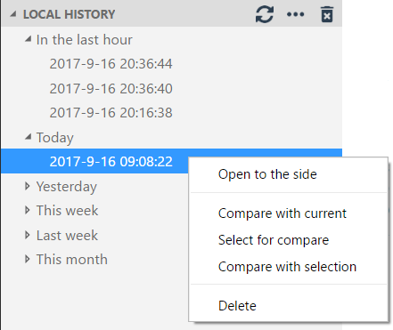

# Local History

A visual source code plugin for maintaining local history of files.

Every time you modify a file, a copy of the old contents is kept in the local history.
At any time, you can compare a file with any older version from the history.
It can help you out when you change or delete a file by accident.
The history can also help you out when your workspace has a catastrophic problem.
Each file revision is stored in a separate file inside the .history folder of your workspace directory
(you can also configure another location, see local-history.path).
e.g., `.history/foo/bar/myFile_20151212205930.ts`

You can easily navigate between history files with the `local-history tree` in the explorer pane. 
When you click on a file, a comparaison with the current version is displayed. 
You can also access other commands via a context menu. 

There is also an html-document (command: `View: Local history`)

## Settings

        "local-history.daysLimit":  30, // A day number to purge local history. (0: no purge)
        "local-history.maxDisplay": 10, // A max files to display with local history commands

        "local-history.path":     // Specify another location for .history folder (null: use workspaceFolder)
        "local-history.absolute": // Save absolute or relative path in local-history.path
            true:  (absolute) // <local-history.path>/.history/<absolutePath>
            false: (relative) // (default) <local-history.path>/.history/<workspaceFolder.basename>/<relativePath>

        "local-history.enabled":
            0: Never     // Possibillity to disabled the extension for some project
            1: Always    // (default) Save also single file with no workspaceFolder ("local-history.path" must be defined)
            2: Workspace // Save only files within workspaceFolder

        "local-history.exclude": // Files or folders to not save
            // (default) ['**/.history/**', '**/.vscode**', '**/node_modules/**', '**/typings/**', '**/out/**']

## Commands

    local-history.showAll // Show all history available to select (limited with maxDisplay settings)
    local-history.showCurrent // Show current version (if history version is active)
    local-history.compareToCurrent // compare current version with another version in history
    local-history.compareToActive // compare active file with another version in history
    local-history.compareToPrevious // compare a version in history with its previous version

    local-history.showViewer // Show the history in a html document

## Note
When .history folder is stored in workspace, you can add a "files.exclude".
This hides .history folder and avoids some issues. (e.g. csproj extension) 
Thanks to @pabloarista (issue [#13](https://github.com/zabel-xyz/local-history/issues/13))
